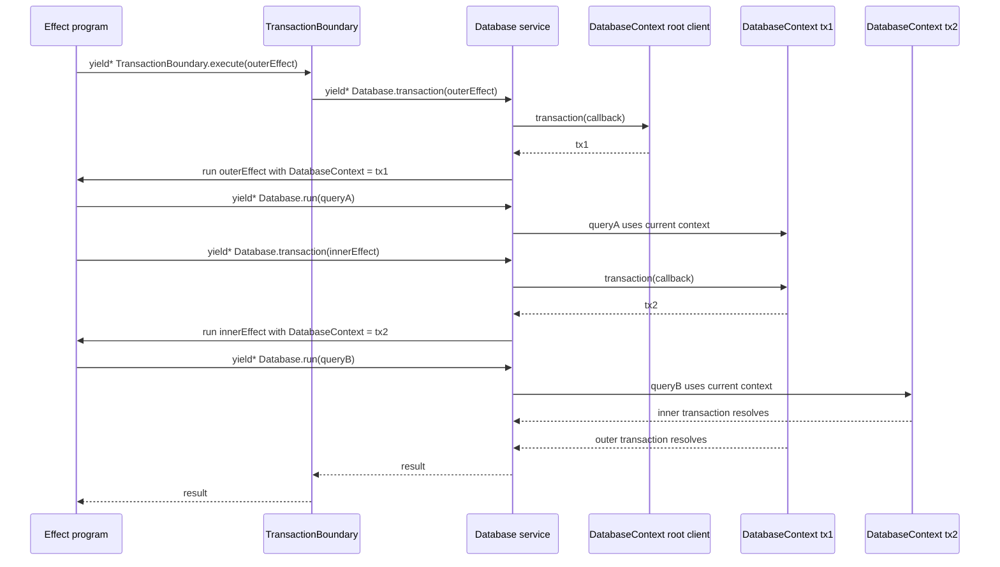

# @codeva-dev/effect-drizzle

A lightweight Effect wrapper for Drizzle.

`@codeva-dev/effect-drizzle` takes a Drizzle client created by your application and exposes it through Effect services. It is intentionally small: it does not create database clients, import schemas, read environment variables, manage migrations, add telemetry, or behave like an ORM.

The main feature is an Effect scope-aware transaction boundary. Queries always use the currently provided `DatabaseContext`; inside a transaction, that context is the transaction client. Repository code can use the same `Database.run(...)` API inside and outside transactions.

## Supported Drivers

This package works with Drizzle clients that expose a `transaction(callback)` API.

The intended driver families are:

- PostgreSQL drivers, including `node-postgres` and `postgres-js`
- Neon drivers, including `neon-serverless`
- MySQL drivers, including `mysql2`
- SQLite/libSQL drivers that expose compatible transaction behavior

The package does not import driver-specific runtime code. Your application owns the Drizzle driver import, client creation, schema, and connection configuration.

## Install

```sh
npm install @codeva-dev/effect-drizzle effect drizzle-orm
```

## Create a Runtime

Create your Drizzle client in the application, then create a typed Effect runtime around that client type.

```ts
import { makeDatabaseRuntime } from '@codeva-dev/effect-drizzle';
import { drizzle } from 'drizzle-orm/neon-serverless';

const db = drizzle(pool, { schema });

type DatabaseClient = typeof db;
type DatabaseTransaction = Parameters<Parameters<DatabaseClient['transaction']>[0]>[0];

export const {
  Database,
  DatabaseContext,
  TransactionBoundary,
  layer: DatabaseLive,
} = makeDatabaseRuntime<DatabaseClient, DatabaseTransaction>();
```

Provide the client at the application boundary:

```ts
const program = Effect.gen(function* () {
  const database = yield* Database;

  return yield* database.run((context) =>
    context.query.UsersTable.findFirst({
      where: eq(UsersTable.id, 1),
    }),
  );
});

await Effect.runPromise(program.pipe(Effect.provide(DatabaseLive(db))));
```

## Database Lifecycle

This package has two separate ways to provide a Drizzle client:

- `Runtime.layer(db)` for clients that are already owned by your application.
- `Runtime.layerScoped(...)` for clients/resources that should be acquired and released by an Effect scope.

The difference matters. `DatabaseContext` is only the currently active Drizzle handle. It is not automatically a connection owner, pool owner, or shutdown hook.

### App-Level Client

Use `Runtime.layer(db)` when your application owns the client lifecycle.

This is usually the right choice for a long-running Node or Bun server. Create the pool once at process startup, reuse it for requests, and close it during app shutdown.

```ts
import { Pool } from '@neondatabase/serverless';
import { drizzle } from 'drizzle-orm/neon-serverless';
import { Effect, Layer } from 'effect';
import ws from 'ws';

import * as schema from './schema';
import { makeDatabaseRuntime } from '@codeva-dev/effect-drizzle';
import { OtherLive } from './OtherLive';

neonConfig.webSocketConstructor = ws;

const connectionString = process.env.NEON_DB_URL;

if (!connectionString) {
  throw new Error('NEON_DB_URL is missing');
}

const pool = new Pool({ connectionString });
const db = drizzle(pool, { schema });

type DatabaseClient = typeof db;
type DatabaseTransaction = Parameters<Parameters<DatabaseClient['transaction']>[0]>[0];

export const DBRuntime = makeDatabaseRuntime<DatabaseClient, DatabaseTransaction>();

export const AppLive = Layer.mergeAll(
  DBRuntime.layer(db),
  OtherLive,
);

export async function shutdown() {
  await pool.end();
}

export async function handler(request: Request) {
  return Effect.runPromise(
    program.pipe(Effect.provide(AppLive)),
  );
}
```

In this mode, `@codeva-dev/effect-drizzle` does not close the pool. Your application owns `pool.end()`.

### Request-Scoped Client

Use `Runtime.layerScoped(...)` when the database resource should live only for the current Effect scope.

This is useful for serverless handlers, CLI scripts, tests, migrations, or any runtime where the driver documentation says that pooling must not be reused across requests.

```ts
import { Pool, neonConfig } from '@neondatabase/serverless';
import { drizzle } from 'drizzle-orm/neon-serverless';
import { Effect, Layer } from 'effect';
import ws from 'ws';

import * as schema from './schema';
import { makeDatabaseRuntime } from '@codeva-dev/effect-drizzle';
import { OtherLive } from './OtherLive';

neonConfig.webSocketConstructor = ws;

function createDatabase(connectionString: string) {
  const pool = new Pool({ connectionString });
  const db = drizzle(pool, { schema });

  return { pool, db };
}

type DatabaseResource = ReturnType<typeof createDatabase>;
type DatabaseClient = DatabaseResource['db'];
type DatabaseTransaction = Parameters<Parameters<DatabaseClient['transaction']>[0]>[0];

export const DBRuntime = makeDatabaseRuntime<DatabaseClient, DatabaseTransaction>();

export function makeRequestLive(connectionString: string) {
  return Layer.mergeAll(
    DBRuntime.layerScoped({
      acquire: Effect.sync(() => createDatabase(connectionString)),
      context: ({ db }) => db,
      release: ({ pool }) => Effect.promise(() => pool.end()),
    }),
    OtherLive,
  );
}

export async function handler(request: Request) {
  const connectionString = process.env.NEON_DB_URL;

  if (!connectionString) {
    return Response.json(
      { error: 'NEON_DB_URL is missing' },
      { status: 500 },
    );
  }

  return Effect.runPromise(
    program.pipe(Effect.provide(makeRequestLive(connectionString))),
  );
}
```

`layerScoped(...)` takes a resource, maps it to the Drizzle context used by queries, and releases the original resource when the Effect scope closes.

```ts
DBRuntime.layerScoped({
  acquire: Effect.sync(() => createDatabase(connectionString)),
  context: ({ db }) => db,
  release: ({ pool }) => Effect.promise(() => pool.end()),
});
```

Use the `context` function when the object needed for release is not the same object that should be provided as `DatabaseContext`. In the example above, queries need `db`, but release needs `pool`.

### Which Lifecycle Should I Use?

| Runtime | Recommended lifecycle |
| --- | --- |
| Long-running Node/Bun server | Create one app-level pool and use `Runtime.layer(db)` |
| TanStack Start on a long-running Node server | Create one app-level pool and use `Runtime.layer(db)` |
| Serverless handler with WebSocket pooling | Create per-request resource with `Runtime.layerScoped(...)` |
| Edge/serverless with Neon HTTP | Prefer the driver-recommended client lifecycle, then provide it with `layer` or `layerScoped` |
| CLI, migration, test process | Prefer `Runtime.layerScoped(...)` so release is guaranteed |

Do not use `layerScoped(...)` to create a new pool per request in a long-running server unless the driver or hosting runtime requires it. For normal long-running Node servers, per-request pool creation loses the benefit of pooling and can increase connection churn.

## Scope-Aware Transactions

`TransactionBoundary.execute(...)` opens a transaction on the currently provided database context. The transaction client is then provided as the new `DatabaseContext` for the Effect program running inside the closure.

```ts
const saveUser = TransactionBoundary.execute(
  Effect.gen(function* () {
    const database = yield* Database;

    yield* database.run((context) =>
      context.insert(UsersTable).values(user),
    );

    return yield* database.run((context) =>
      context.query.UsersTable.findFirst({
        where: eq(UsersTable.id, user.id),
      }),
    );
  }),
);
```

The repository code does not need to know whether it is running inside a transaction. It only asks for `Database` and calls `Database.run(...)`; the active Effect scope decides which database context is used.

Nested transactions open a new Drizzle transaction on the active context. For drivers that implement nested transactions with savepoints, this gives nested unit-of-work behavior.



You can also call the lower-level transaction method directly:

```ts
const saveUser = Effect.gen(function* () {
  const database = yield* Database;

  return yield* database.transaction(
    Effect.gen(function* () {
      yield* database.run((context) =>
        context.insert(UsersTable).values(user),
      );

      return yield* database.run((context) =>
        context.query.UsersTable.findFirst({
          where: eq(UsersTable.id, user.id),
        }),
      );
    }),
  );
});
```

## Mock Clients

Drizzle exposes driver-level `drizzle.mock(config)` helpers for several drivers. `createDrizzleMockClient(...)` keeps the driver import in your application and adds transaction support suitable for `TransactionBoundary` tests.

```ts
import { createDrizzleMockClient } from '@codeva-dev/effect-drizzle';
import { drizzle } from 'drizzle-orm/neon-serverless';

const mockDb = createDrizzleMockClient(drizzle, { schema });

await Effect.runPromise(
  program.pipe(Effect.provide(DatabaseLive(mockDb))),
);
```

For MySQL drivers, pass the same config shape that the driver mock expects:

```ts
const mockDb = createDrizzleMockClient(mysqlDrizzle, {
  schema,
  mode: 'default',
});
```

## Errors

SQL and Drizzle-shaped errors are normalized into typed `Schema.TaggedError` classes:

- `UniqueConstraintError`
- `ForeignKeyConstraintError`
- `NotNullConstraintError`
- `CheckConstraintError`
- `DatabaseConnectionError`
- `DatabaseTimeoutError`
- `DatabaseTransactionError`
- `UnknownSqlError`

Unexpected non-SQL failures are treated as defects.

## Contributing

Contributions are more than welcome.

Useful ways to contribute:

- report bugs with minimal reproduction cases;
- share driver compatibility feedback;
- improve SQL dialect error mapping;
- improve documentation and examples;
- add tests for new Drizzle driver mock behavior;
- discuss API design for transaction, domain event, and outbox use cases.

Local workflow:

```sh
npm install
npm run check
npm pack --dry-run
```
